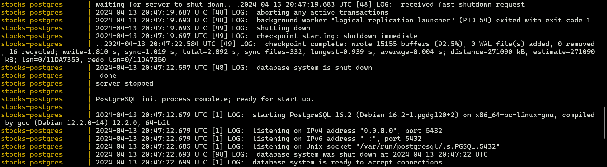
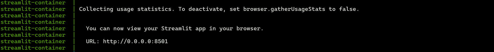
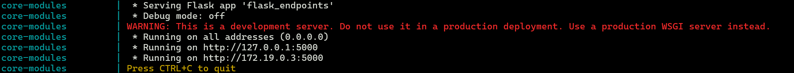
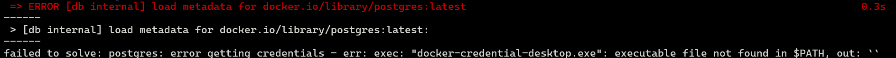

As mentioned previously, what we are trying to achieve is to have three separate containers, one for each microservice, that communicates with each other via RESTful API and database connection. 

An ***NFS server*** is set up to allow sharing of database backup file (*.dump*) with the ***database container***.

The ***database container*** acts as an NFS client and accesses the directory shared by the ***NFS server***. The ***database container*** then restores the database via *pg_restore*. After that, the ***database container*** is ready to accept connections to the database.

The ***business logic container*** receives requests sent from the user via the ***web app container*** and sends them to the ***database container*** via *database connection*. After the ***database container*** returns the data, the ***business logic container*** then processes the data and returns it in a certain format to the ***web app container***.

The ***web app container*** receives the data from the ***business logic container***, does some simple processing and displays the data back to the user.

As each container depends on one another. It is vital to set them up accordingly. Before you start, ensure that you have the folllowing dependencies installed:
-  Docker
-  net-tools (to get your IP address)
-  API Key from NewsAPI
-  vim (optional)

## To set-up

1. Clone the project repository using Git.

2. Paste NewsAPI Key into *parameters.py* under *NEWS_API_KEY*

3. There are three methods to provide the ***database container*** with the backup (*.dump*) file:

    === "The NFS method"

        As discussed previously, the NFS method sets up an NFS server and shares files with the NFS client.

        1. Get your ip address:

            Open a terminal and type ```ifconfig``` or ```ip a``` Look for the *inet* or *inet addr* entry under the relevant network interface. It is usually the first one from the top.

        
        2. Save your IP Address in a global variable *<HOST_IP\>*.

            ```export HOST_IP=<your IP address>```

        3. Install NFS

            1. ```sudo apt install nfs-kernel-server```
            2. ```sudo systemctl start nfs-kernel-server.service```
            3. ```sudo vim /etc/exports``` NOTE: Replace *vim* with the editor of your choice.
            4. Add ```<path-to-cloned-repository>/network-directory  *(rw,sync,no_root_squash,no_subtree_check)```
            5. ```sudo exportfs -a```

    === "The non-NFS *volume mounting* method"

        The non-NFS *volume mounting* method mounts a local volume with the container and allows the container to access the required backup file through the shared volume.

        1. In the *docker-compose.yml*, comment out the *volumes* section (lines 53-59).

        2. Replace ```- nfs-volume:/nfs ``` in line 16 with ```- ./network_directory:/nfs```

    === "The non-NFS *docker copy* method"

        The non-NFS *docker copy* method uses the *docker copy* to copy the required file to the correct directory in the container.

        1. In the *docker-compose.yml*, comment out the *volumes* section (lines 53-59).

        2. In the *docker-compose.yml*, comment out the *volumes* section in *db* (lines 15-16).

        3. In the terminal, type ```docker copy ./network_directory/db.dump stocks-postgres:/nfs```

4. Run ```docker compose up```

    If successful, you should see three different parts as illustrated below:
  
    - Stocks-postgres
    

    - Streamlit
    

    - Core-modules
    

5. Once user is able to see the three successful images, user can now go to **127.0.0.1:8501** using your web browser to access the app.

## To stop the application

1. Run ```docker compose down```

2. Run ```docker image rm stocktracker-db:latest```

3. Run ```docker image rm stocktracker-core:latest```

4. Run ```docker image rm stocktracker-web:latest```

5. Run ```docker network rm stocks-network```

6. If you have NFS set up, run ```docker volume rm stocktracker_test-volume```


## Common issues:

### 1. Load metadata error



Could either remove ```"credsStore": "desktop.exe"``` from ```~/.docker/config.json``` **OR** ```docker pull postgres && docker pull ubuntu:22.04 && docker pull python:3.10-slim```

- Rerun ```docker compose up```

### 2. Missing core-modules successful image

If the *streamlit* image appeared before the *core-modules* image, give it 30 seconds and it should appear. This is because the ***core-modules container*** is *"eager-loading"* the data of the database and saving it in a local variable.
